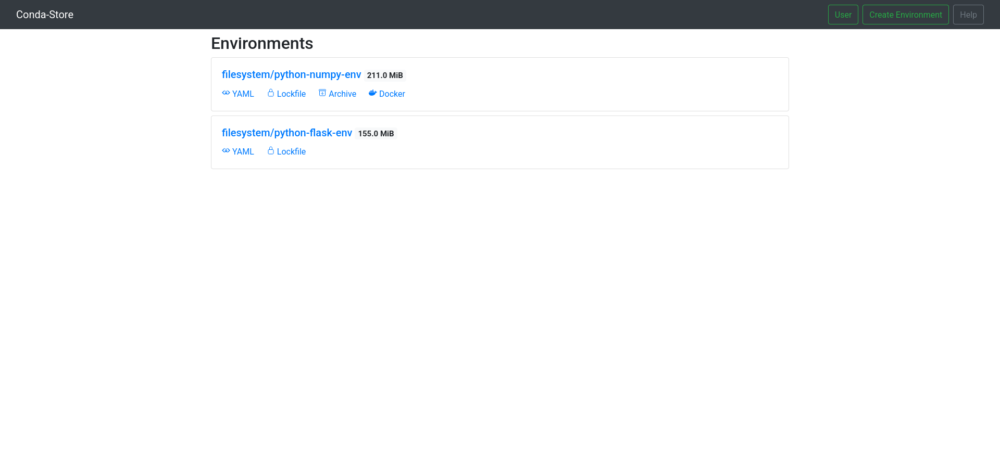

# conda-store

<a href="https://conda-store.readthedocs.io/en/latest/">
  
</a>

<a href="https://pypi.org/project/conda-store-server/">
  
</a>

<a href="https://pypi.org/project/conda-store/">
  
</a>

<a href="https://anaconda.org/conda-forge/conda-store-server">
  
</a>

<a href="https://anaconda.org/conda-forge/conda-store">
  
</a>



## Documentation

All documentation can be found on Read the Docs including how to develop
and contribute to the
project. [conda-store.readthedocs.io](https://conda-store.readthedocs.io).

## Installation

`conda-store` has two packages a `conda-store` (the client) and
`conda-store-server` (the server). Make sure that either `conda` or
`mamba` are in your path.

```shell
conda install -c conda-forge conda-store-server conda-store
```

The `conda-store` server can be easily launched in standalone mode
that carries no dependencies on databases, object storage, redis.

```
conda-store-server --standalone
```

Standalone mode runs all components together to simplify
deployment. For more complex and scalable setups there are
[installation examples for containerized and distributed
environments](docs/installation.md).

## Motivation

End users think in terms of environments not packages. The core
philosophy of conda-store is to serve identical Conda environments in
as many ways as possible. conda-store controls the environment
lifecycle: management, builds, and serving of environments.

It **manages** Conda environments by:
 - watching specific files or directories for changes in environment filename specifications 
 - provides a REST API for managing environments (which a JupyterLab plugin is being actively developed for)
 - provides a command line utility for interacting with conda-store `conda-store env [create, list]`
 - provides a web UI to take advantage of many of conda-store's advanced capabilities

It **builds** Conda specifications in a scalable manner using `N`
workers communicating via Celery to keep track of queued
environment builds.

It **serves** Conda environments via a filesystem, lockfile, tarball,
and a docker registry. Tarballs and Docker images can carry a lot of
bandwidth which is why conda-store integrates optionally with `s3` to
actually serve the blobs.

## Terminology

 - A `namespace` is a way of scoping environments

 - An `environment` is a `namespace` and `name` pointing to a particular `build`

 - A `specification` is a Conda environment `yaml` declaration with fields `name`,
   `channels`, and `dependencies` as detailed
   [here](https://docs.conda.io/projects/conda-build/en/latest/resources/package-spec.html)
   
 - A `build` is a build (`conda env create -f <specification>`) of a
   particular `specification` at a point in time for a given `namespace`

This design has several advantages:
 - `environments` can be "rolled back" to a given `build` - not necessarily the latest
 - because each `environment` update is a new separate build the
   environment can be archived and uniquely identified


## Philosophy

We mentioned above that `conda-store` was influenced by
[nix](https://nixos.org/). While Conda is not as pure as nix (when it
comes to reproducible builds) we can achieve close to the same results
with many of the great benefits. Motivation
from this work came from the following projects in no particular
order: [lorri](https://github.com/target/lorri), [nix layered docker
images](https://grahamc.com/blog/nix-and-layered-docker-images),
[nix](https://nixos.org/), [nixery](https://nixery.dev/). 

1. specifications are idempotent, created once, and never updated
   (this means there is no `conda install` or `conda env update`). In
   fact there is only one Conda command `conda env create -f
   <specification>`.
2. specifications are named
   `<sha256-hash-of-spec>-<environment-name>`, ensuring every Conda
   environment is unique.
3. a Conda environment for example `<environment-name>` is symlinked to a
   specific Conda specification
   `<sha256-hash-of-spec>-<environment-name>`.

The benefits of this approach are versioning of environments, heavy
caching, and rollbacks to previous environment states. 

## License

conda-store is [BSD-3 LICENSED](./LICENSE)

## Contributing

Our [documentation has all the information needed for
contributing](https://conda-store.readthedocs.io/en/latest/contributing.html). We
welcome all contributions.
