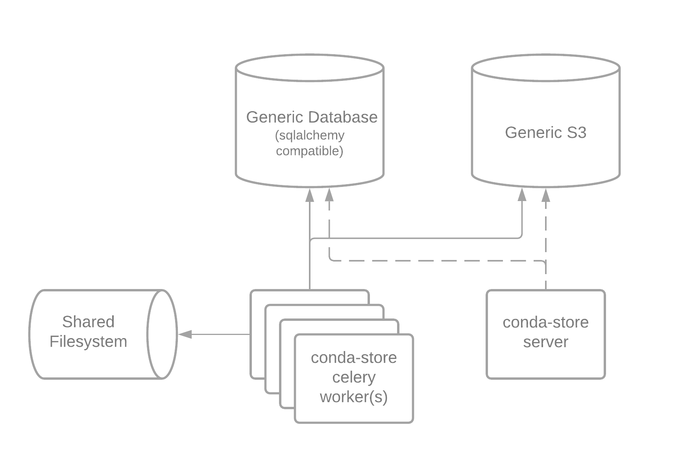
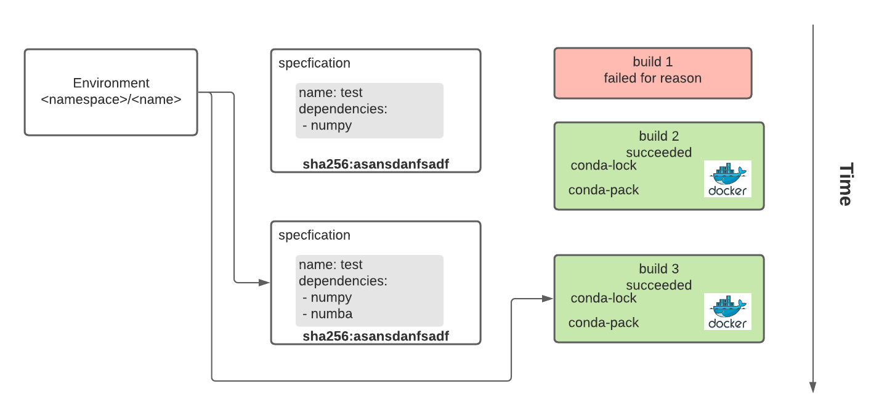

# Contributing

## Development

The following are needed for development

 - [docker](https://docs.docker.com/engine/install/)
 - [docker-compose](https://docs.docker.com/compose/install/)

To deploy `conda-store` run the following command

```shell
docker-compose up --build
```

The following resources will be available:
  - conda-store web server running at http://localhost:5000
  - minio s3 running at http://localhost:9000 with username `admin` and password `password`
  - postgres running at localhost:5432 with username `admin` and password `password` database `conda-store`
  - jupyterhub running at http://localhost:8000 with any username and password `test`

On a fast machine this deployment should only take 10 or so seconds
assuming the docker images have been partially built before. If you
are making and changes to conda-store-server and would like to see
those changes in the deployment. Run.

```shell
docker-compose down  # not always necissary
docker-compose up --build
```

## Documentation

The following are needed for development

 - [conda](https://docs.conda.io/projects/conda/en/latest/user-guide/install/)

To build the documentation install the development environment via
conda.

```shell
conda env create -f conda-store-server/environment-dev.yaml
conda activate conda-store-server-dev
```

Then go in the documentation directory `docs` and build the
documentation.

```shell
cd docs
sphinx-build -b html . _build
```

Then open the documentation via your favorite web browser.

```shell
firefox _build/index.html
```

The documentation has been primarily written in markdown as to make it
easier to contribute to the documentation.

## REST API

### Status

 - `GET /api/v1/` :: get status of conda-store

### Namespace

 - `GET /api/v1/namespace/` :: list namespaces

### Environments

 - `GET /api/v1/environment/?search=<str>&page=<int>&size=<int>` :: list environments

 - `GET /api/v1/environment/<namespace>/<name>/` :: get environment

 - `PUT /api/v1/environment/<namespace>/<name>/` :: update environment to given build id
 
### Specifications

 - `POST /api/v1/environment/` :: create given environment
 
### Builds

 - `GET /api/v1/build/?page=<int>&size=<int>` :: list builds

 - `GET /api/v1/build/<build_id>/` :: get build

 - `PUT /api/v1/build/<build_id>/` :: trigger new build of given build specification

 - `DELETE /api/v1/build/<build_id>/` :: delete given build

 - `GET /api/v1/build/<build_id>/logs/` :: get build logs

### Packages

 - `GET /api/v1/channel/?page=<int>&size=<int>` :: list channels

### Packages

 - `GET /api/v1/package/?search=<str>&page=<int>&size=<int>` :: list packages

### REST API Query Format

For several paginated results the following query parameters are accepted.

 - `page` page numbers indexing start at 1
 - `size` the number of results to return in each page. The max size
   is determined by the traitlets parameter
   `c.CondaStoreServer.max_page_size` with default of 100.

If a query requests a page that does not exist a data response of an
empty list is returned.

### REST API Response Format

Several Standard Error Codes are returned
 - 200 :: response was processed normally
 - 400 :: indicates a bad request that is invalid
 - 401 :: indicates that request was unauthenticated indicates that authentication is required
 - 403 :: indicates that request was not authorized to access resource
 - 404 :: indicates that request for resource was not found
 - 500 :: hopefully you don't see this error. If you do this is a bug

Response Format for Errors.

```json
{
   "status": "error",
   "message": "<reason for error>"
}
```

Response Format for Success. Several of these response parts are
optional. A route may optionally return a `message` that may be
displayed to the user.

If the route is paginated it will return a `page`, `size`, and `count`
key.

```json
{
   "status": "ok",
   "message": "<message>",
   "data": [...],
   "page": <int>,
   "size": <int>,
   "count": <int>,
}
```

Ifthe route is not paginated the `page`, `size`, and `count` keys will
not be returned.

```json
{
   "status": "ok",
   "message": "<message>",
   "data": {...},
}
```

## Architecture

Conda Store was designed with the idea of scalable enterprise
management of reproducible conda environments.



### Configuration

[Traitlets](https://traitlets.readthedocs.io/en/stable/) is used for
all configuration of conda-store. In the beginning command line
options were used but eventually we learned that there were too many
options for the user. Traitlets provides a python configuration file
that you can use to configure values of the applications. It is used
for both the server and worker. See
[tests/assets/conda_store_config.py](https://github.com/Quansight/conda-store/blob/main/tests/assets/conda_store_config.py)
for a full example.

### Workers and Server

Conda Store can be broken into two components. The worker(s) which
have the following responsibilities:
 - build Conda environments from Conda `environment.yaml` specifications
 - build Conda pack archives
 - build Conda docker images
 - remove Conda builds
 - modify symlinks to point current environment to given build

All of the worker logic is in `conda_store_server/build.py` and
`conda_store_server/worker/*.py`. Celery is used for managing tasks so
you will see the celery tasks defined in
`conda_store_server/worker/tasks.py` which in turn usually call built
in `CondaStore` functions in `conda_store_server/app.py` or
`conda_store_server/build.py`.
 
The web server has several responsibilities:
 - serve a ui for interacting with conda environments
 - serve a rest api for managing conda environments
 - serve a programmatic docker registry for interesting docker-conda abilities

The web server is based on
[Flask](https://flask.palletsprojects.com/en/2.0.x/). Flask was chosen
due to it being battle tested and that conda-store is not doing any
special things with the web server. The flask app is defined in
`conda_store_server.server.app`. There are several components to the server:
 - ui :: `conda_store_server/server/views/ui.py`
 - api :: `conda_store_server/server/views/api.py`
 - registry :: `conda_store_server/server/views/registry.py`

Both the worker and server need a connection to the database and s3
server. The s3 server is used to store all build artifacts e.g. logs,
docker layers, and the conda pack tarball. The postgresql database is
used for managing the tasks for the conda-store workers along with
powering the conda-store web server ui, api, and docker
registry. Optionally a broker can be used for tasks that is not a
database e.g. a message queue similar to rabbitmq, kafka, etc. It is
not believed that a full blown message queue will help conda-store with
performance.

### Terminology



`conda_environment = f(open("environment.yaml"), datatime.utcnow())` 

 - namespace :: a way of providing scopes between environments. This
   prevents joe's environment named `data-science` from colliding from
   Alice's environment name `data-science`.
 - environment :: a pointer to a current build of a given specification
 - specification :: a [Conda environment.yaml file](https://docs.conda.io/projects/conda/en/latest/user-guide/tasks/manage-environments.html#create-env-file-manually)
 - build :: a attempt of `conda env install -f environment.yaml` at a
   given point in time

In order to understand why we have the complicated terminology for an
environment it helps to understand how conda builds a given
environment. 

### Reproducibility of Conda 

```yaml
name: example
channels:
  - defaults
  - conda-forge
dependencies:
  - python >=3.7
```

Suppose we have the given `environment.yaml` file. How does conda
perform a build?

1. Conda downloads `channeldata.json` from each of the channels which
   list the available architectures.
   
2. Conda then downloads `repodata.json` for each of the architectures
   it is interested in (specifically your compute architecture along
   with noarch). The `repodata.json` has fields like package name,
   version, and dependencies.

You may notice that the channels listed above do not have urls. This
is because in general you can add
`https://conda.anaconda.org/<channel-name>` to a non-url channel. 

3. Conda then performs a solve to determine the exact version/sha of each
   package that it will download

4. The specific packages are downloaded

5. Conda does magic to fix the path prefixes of the install

There are two spots that introduce issues to reproducibility. The
first issue is tracking when an `environment.yaml` file has
changes. This can be easily tracked by taking a sha256 of the file
. This is what conda-store does but sorts the dependencies to make
sure it has a way of not triggering a rebuild if the order of two
packages changes in the dependencies list. In step (2) `repodata.json`
is updated regularly. When conda solves for a user's environment it
tries to use the latest version of each package. Since `repodata.json`
could be updated the next minute the same solve for the same
`environment.yaml` file can result in different solves.

### Authentication Model

Authentication was modeled after JupyterHub for implementation. There
is a base class `conda_store_server.server.auth.Authenticaiton`. If
you are extending and using a form of OAuth2 use the
`conda_store_server.server.auth.GenericOAuthAuthentication`. Similar
to JupyterHub all configuration is modified via
[Traitlets](https://traitlets.readthedocs.io/en/stable/). Below shows
an example of setting us OAuth2 via jupyterhub for conda-store.

```python
c.CondaStoreServer.authentication_class = JupyterHubOAuthAuthentication
c.JupyterHubOAuthAuthentication.jupyterhub_url = "http://jupyterhub:8000"
c.JupyterHubOAuthAuthentication.client_id = "service-this-is-a-jupyterhub-client"
c.JupyterHubOAuthAuthentication.client_secret = "this-is-a-jupyterhub-secret"
```

Once a user is authenticated a cookie or token [jwt](https://jwt.io/)
is created to store the user credentials to ensure that conda-store is
as stateless as possible. At this current point in time conda-store
does not differentiate between a service and user. Similar to
jupyterhub `conda_store_server.server.auth.Authentication` has an
`authenticate` method. This method is the primary way to customize
authentication. It is responsible for checking that the user
credentials to login are correct as well as returning a dictionary
following the schema
`conda_store_server.schema.AuthenticationToken`. This stores a
`primary_namespace` for a given authenticated service or user. In
addition a dictionary of `<namespace>/<name>` map to a set of
roles. See the Authorization model to better understand the key to set
of roles meaning.

### Authorization Model

Conda-Store implements role based authorization to supports a flexible
authorization model. A user or service is either authenticated or
not. There are a set of default permissions assigned to authenticated
and unauthenticated users via Traitlets. These can all be modified in
the configuration. These roles are inherited based on the
authentication status of the user or service. To support hierarchies
we map a key such as `default/*` to a set of roles. The `/` separates
the `<namespace>` from the `<name>` and `*` signifies match any (zero
or more) characters. This was chosen to support rich authorization
models while also being easy and efficient to implement in a
database. `*` are supported anywhere in the `key` such as
`*n*viron*/n*me`. Configure the following traitlets to modify the
inherited permissions for authenticated and unauthenticated users.

```python
c.RBACAuthorizationBackend.unauthenticated_role_bindings = {
    "default/*": {"viewer"},
}

c.RBACAuthorizationBackend.authenticated_role_bindings = {
    "default/*": {"viewer"},
    "filesystem/*": {"viewer"},
}
```

Once we have collected the role mappings that a given user has we then
map `roles` to sets of permissions. Currently there are only a few
permissions but Conda-Store is capable of adapting in the future.

```python
class Permissions(enum.Enum):
    ENVIRONMENT_CREATE = "build::create"
    ENVIRONMENT_READ = "build::read"
    ENVIRONMENT_UPDATE = "build::update"
    ENVIRONMENT_DELETE = "build::delete"
```

The role name to permission is configured via a single traitlet shown
below.

```python
c.RBACAuthorizationBackend.role_mappings = {
    "viewer": {
        Permissions.ENVIRONMENT_READ
    },
    "developer": {
        Permissions.ENVIRONMENT_CREATE,
        Permissions.ENVIRONMENT_READ,
        Permissions.ENVIRONMENT_UPDATE,
    },
    "admin": {
        Permissions.ENVIRONMENT_CREATE,
        Permissions.ENVIRONMENT_READ,
        Permissions.ENVIRONMENT_UPDATE,
        Permissions.ENVIRONMENT_DELETE,
    },
}
```

Lets go through a few examples to make this more concrete and assume
the default configuration of conda-store.

> Suppose we have an unauthenticated user trying to view the
> environment `quansight/datascience`.

First since the user is unauthenticated they inherit the default role
mappings.

```
{
    "default/*": {"viewer"},
}
```

We go through each role mapping and try to match the expression
`default/*` to `quansight/datascience`. In this case this does not
match and thus for the given environment `quansight/datascience` the
unauthenticated user has no roles. This user does not have any roles
for the given environment but if they did we would iterate through all
roles and combine the permissions. The next example will show this. So
for this example the user has permissions `{}` in the given
environment. The action of viewing a given environment requires
`build::read` which the unauthenticated user does not have.

> Suppose we have an unauthenticated user trying to delete the
> environment `default/web-dev`.

First since the user is unauthenticated they inherit the default role
mappings.

```
{
    "default/*": {"viewer"},
}
```

We go through each role mapping and try to match the expression
`default/*` to `default/web-dev`. In this case this does match and
thus for the given environment `default/web-dev` the unauthenticated
user has role(s) `{viewer}`. For each role we map the role to
permissions. We get `{build::read}`. The delete environment action
requires `build::delete` permissions and thus the user is not
authenticated to perform the action.

> Suppose we have an authenticated user trying to delete the
> environment `default/web-dev`.

First since the user is authenticated they inherit the default role
mappings.

```python
{
    "default/*": {"viewer"},
    "filesystem/*": {"viewer"},
}
```

In addition to the default role bindings the user was authenticated
via the `authenticate` method and has the following bindings added.

```python
{
    "*/*": {"admin"}
}
```

In total the user has the following bindings.

```python
{
    "default/*": {"viewer"},
    "filesystem/*": {"viewer"},
    "*/*": {"admin"},
}
```

Following the same process as before we iterate through each binding
if it matches we add the given role(s). For this example we get
`{viewer, admin}`. Next we iterate through each role and map it to
permissions and we get the following `{build::create, build::read,
build::update, build::delete}`. The delete environment action requires
`build::delete` permissions which the user has thus the action is
permitted.

