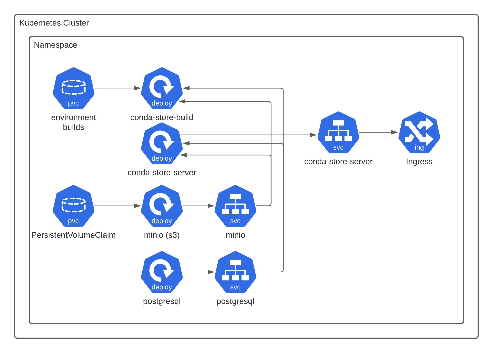

# Installation

## Kubernetes



The following will describe a local kubernetes installation via
minikube. The files required are in `examples/kubernetes`

```shell
minikube start --cpus 2 --memory 4096 --driver=docker
```

Now we deploy the `conda-store` components. Note that conda-store is
compatible with any general s3 like provider and any general database
via sqlalchemy. Currently the docker image is build with support for
postgresql and sqlite. Consult the [sqlalchemy
documentation](https://docs.sqlalchemy.org/en/14/core/engines.html#database-urls)
on supporting your given database and then creating a custom docker
image with your required database. Not all database engines were added
to save on image size. Additionally You may not need to use minio and
postgresql deployments and use existing infrastructure. In the case of
AWS this may mean using [rds](https://aws.amazon.com/rds/) and
[s3](https://aws.amazon.com/s3/). Consult your cloud provider for
compatible services. In general if it is supported by sqlalchemy and
there is a s3 compatible object store conda-store will
work. [kustomize](https://github.com/kubernetes-sigs/kustomize) is
being used for the deployment which is part to the kubernetes project
itself.

```shell
kubectl apply -k examples/kubernetes
```

Make sure to change all the usernames and passwords for the
deployment.

If your installation worked you should be able to port forward the
conda store web server.

```shell
kubectl port-forward service/conda-store-server 5000:5000
```

Then visit via your web browser http://localhost:5000

For additional configuration options see the [administrative
guide](./administration.md)

A good test that conda-store is functioning properly is to apply the
`jupyterlab-conda-store` pod as a quick test. It will cause
conda-store to build an environment with jupyterlab and numpy. This
pod is not needed for running conda-store.

```shell
kubectl apply -f examples/kubernetes/test/jupyterlab-conda-store.yaml
```

If you instead mount a
[ReadWriteMany](https://kubernetes.io/docs/concepts/storage/persistent-volumes/)
volume to the container `conda-store-worker` like nfs or
[efs](https://aws.amazon.com/efs/). You can mount the environments
built via conda-store and use environments this way. Note that NFS can
be significantly slower when it comes to creating environments (see [performance docs](./administration.md#Performance)).

## Docker

To install on a local docker daemon there is an existing
docker-compose.yaml for deployment. The example files required are in
`examples/docker`

```shell
docker-compose up
```

Then visit via your web browser http://localhost:5000. By default, you can log in with any username and use the password `test`, since [we are using](https://github.com/Quansight/conda-store/blob/a679e5c4d2f2fe7d992fd93c5d90c34b38c513ef/tests/assets/jupyterhub_config.py#L4) the [DummyAuthenticator](https://github.com/jupyterhub/jupyterhub/blob/4e7936056744cdad31d608388a349207196efa56/jupyterhub/auth.py#L1122)

## Local Automated Systemd Install

Not all environment are containerized and conda-store recognizes
that. The goal of conda-store is to provide conda environments in as
many ways as possible so it SHOULD support non-contianerized
environments. The example files required are in
`examples/ubuntu2004`. 

This example is not fully complete in that it does not install
`conda-store` and get it running due to the [conda-forge
package](https://github.com/conda-forge/staged-recipes/pull/13933).

If you would like to test it in a VM use the following. The following
`Vagrantfile` is only compatible with [libvirt](https://libvirt.org/).

```shell
vagrant up
```

However if you want to do a local deployment use

```shell
ansible-playbook -i <inventory> playbook.yaml
```
