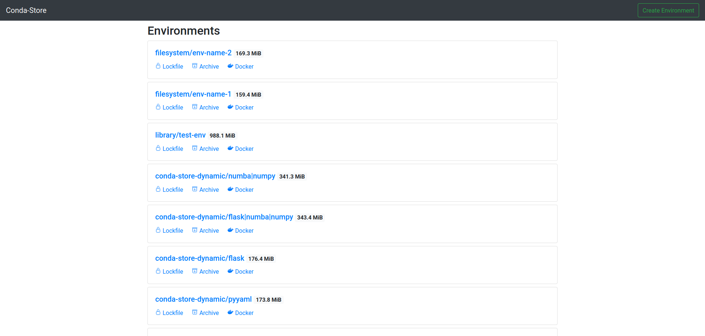
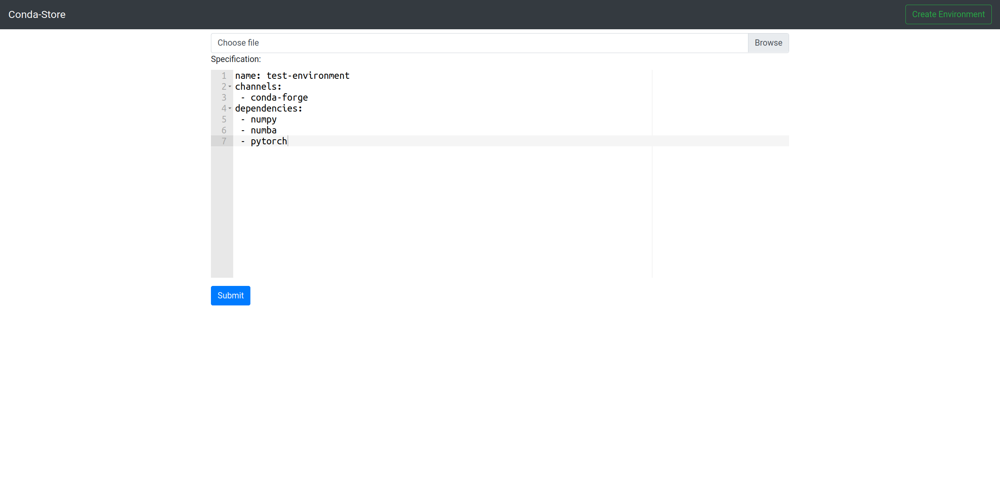
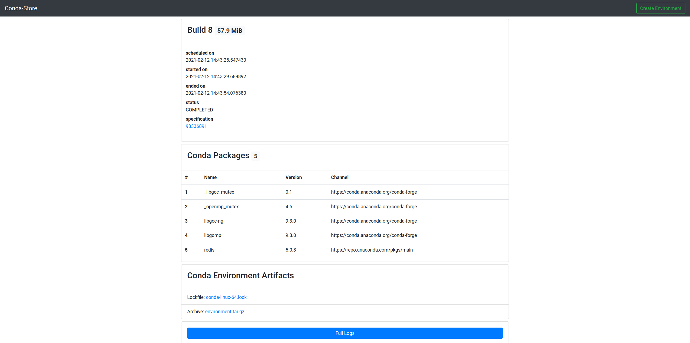

# Usage

## Conda Store UI



The home page shows all of the available environments
`<namespace>/<environment-name>`. In the top right hand corner there
is a button to create new user environments.



The environment creation pages allows for dragging and dropping
environment.yaml files along with editing the environment.



Once an environment has been successfully built you can view
information about the completed build including: packages, a lockfile
for reproducibly creating the environment, a conda pack file of the
conda environment, and a docker registry url to the build.

## Conda Store Docker Registry

Conda Store is a full programatic docker registry which allows for
interesting ways to handle Conda environment. In addition this
registry leverages
[conda-docker](https://github.com/conda-incubator/conda-docker) which
builds docker images without docker allowing for advanced caching,
reduced image sizes, and not require elevated privileges.

General usage

```shell
docker run -it localhost:5000/<namespace>/<environment-name>
```

If you want to use a specific build (say one that was built in the
past and is not the current environment) you can specify a sha256 hash
of the specification as the tag name.

```shell
docker run -it localhost:5000/<namespace>/<environment-name>:<specification_sha256>
```

## Conda Store REST API

### Environments

 - GET /api/v1/environment/ :: list environments

 - GET /api/v1/environment/<environment-name>/ :: get environment
 
### Specifications

 - GET /api/v1/specification/ :: list specifications

 - POST /api/v1/environment/ :: create specification
 
 - GET /api/v1/specification/<sha256>/ :: get specification
 
### Builds

 - GET /api/v1/build/ :: list builds
 - GET /api/v1/build/<build_id>/logs/ :: get build logs

### Packages

 - GET /api/v1/package/ :: list packages
