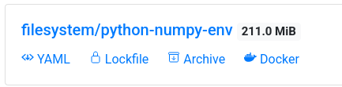

# User Guide

## Environments

Below is an image of a single environment. The following will describe
what the `yaml`, `lockfile`, `archive`, and `docker` represent.



## Pinned YAML

A pinned yaml file is generated for each environment is built. This
includes pinning of the pip packages as well. Note that there are
cases where the completely pinned packages do not solve. Packages are
routinely marked as broken and removed. Note however
[conda-forge](https://conda-forge.org/docs/maintainer/updating_pkgs.html#packages-on-conda-forge-are-immutable)
has a policy that packages are never removed but are marked as
broken. Most channels do not obey this policy. When you click the
`yaml` button a yaml file will then be downloaded. To install the
environment locally run the following.

```shell
conda env create -f <environment-filename>
```

## Conda Lockfile

A conda lockfile is a representation of only the conda dependencies in
a given environment. The lockfile feature was inspired from
[conda-lock](https://github.com/conda-incubator/conda-lock). This file
will not reproduce the pip dependencies in a given environment. When
working with conda it is generally not a good idea to mix conda and
pip dependencies. Click the `lockfile` icon to download the
lockfile. First install `conda-lock` if it is not already installed.

```shell
conda install -c conda-forge lockfile 
```

Install the locked environment file from conda-store.

```shell
conda-lock install <lockfile-filename>
```

## Conda Pack Archive

[conda-pack](https://conda.github.io/conda-pack/) is a package for
crating tarballs of given conda environments. Creating a conda archive
is not as simple as packing and unpacking a given directory. This is
do to the base path for the environment that may
change. [conda-pack](https://conda.github.io/conda-pack/) handles all
of these issues. Click the `archive` button and download the given
environment. The size of the archive will be less than the size seen
on the environment ui element due to compression.

```shell
conda install -c conda-forge conda-pack
```

Install the conda-pack tarball. The directions are [slightly
complex](https://conda.github.io/conda-pack/#commandline-usage). Note
that `my_env` can be any name in any given prefix.

```shell
mkdir -p my_env
tar -xzf <conda-pack-tarfile>.tar.gz -C my_env

source my_env/bin/activate

conda-unpack
```

## Docker Registry

Conda Store acts as a full programatic docker registry which allows
for interesting ways to handle Conda environment. In addition this
registry leverages
[conda-docker](https://github.com/conda-incubator/conda-docker) which
builds docker images without docker allowing for advanced caching,
reduced image sizes, and not require elevated privileges. Click on the
`docker` link this will copy a url to your clipboard. Note the
beginning of the url e.g. `localhost:5000/`. This is required to tell
docker where the docker registry is located. Otherwise by default it
will try and user docker hub. Your url will likely be different.

```
docker pull <docker-url>
docker run -it <docker-url> python
```

### General usage

```shell
docker run -it localhost:5000/<namespace>/<environment-name>
```

If you want to use a specific build (say one that was built in the
past and is not the current environment) you can visit the specific
build that you want in the ui and copy its docker registry tag
name. The tag name is a combination of `<specification-sha256>-<build
date>-<build id>-<environment name>` that we will refer to as build
key. An example would be
`localhost:5000/filesystem/python-numpy-env:583dd55140491c6b4cfa46e36c203e10280fe7e180190aa28c13f6fc35702f8f-20210825-180211-244815-3-python-numpy-env`.

```shell
docker run -it localhost:5000/<namespace>/<environment-name>:<build_key>
```

### On Demand Docker Image

Conda-store has an additional feature which allow for specifying the
packages within the docker image name itself without requiring an
actual environment to be created on the conda-store ui side.

The following convention is used
`<registry-url>:<registry-port>/conda-store-dynamic/`. After
`conda-store-dynamic` you specify packages needed separated by
slashes. Additionally you may specify package constraints
e.g. `<=1.10` as `.lt.1.10`. 

As full example support we want python less than `3.8` and numpy
greater than `1.0`. This would be the following docker image
name. `<registry-url>:<registry-port>/conda-store-dynamic/python.lt.3.8/numpy.gt.1.0`. Conda-store
will then create the following environment and the docker image will
download upon the docker image being built.

## Conda Store UI

### `/` Home Page 


The home page shows all of the available environments in the form
`<namespace>/<environment-name>`. If you are authenticated there with
be a `User` button in the top right hand corner to view information
about the currently logged in user. Otherwise there this a `login`
button and significantly less environments will be visible if
any. Additionally there is a convenient `Create Environment` button to
easily create a given environment. There is a `Docs` button that will
take you to the documentation you are currently reading at any time.

Below each of the available environments are shortcuts that allow you
to download of view the [conda
lockfile](https://github.com/conda-incubator/conda-lock),
[yaml](https://docs.conda.io/projects/conda/en/latest/user-guide/tasks/manage-environments.html#creating-an-environment-from-an-environment-yml-file),
[conda pack](https://github.com/conda/conda-pack).

### `/login/` Login


If you are unauthenticated there is a `login` button on the top
navigation bar. This will direct you to the login page. The example
above shows what you will get with JupyterHub authentication.

### `/user/` User


Once a user has completed the authentication flow they will be
directed to the user page. At the moment this page only exposes the
option to logout and the `username` of the registered user.

### `/create/` Create Environment


A user authenticated or unauthenticated has set permissions that allow
the user to create environments in a given namespace. Currently the
create page allows for dragging and uploading of current
`environment.yaml` files in the UI. The specification is the format of
a traditional `environment.yaml` and will report errors if there are
issues with the format of the environment file.

### `/environment/<namespace>/<name>/` Environments


The environment page a lot of information available to the
developer. First we see the environment name and namespace along with
the disk space that the environment consumes. Right below this
information is the full `environment.yaml` specification of the
currently activated build. User's can quickly edit this existing
environment by clicking the `edit` button.

Below this is a list of the current builds of the given
environment. The environment highlighted in `green` is the current
build for the given environment that is activate. The environment
highlighted in `grey` indicates that the build was deleted. Even
though a build may be deleted the logs, lockfile, and a other build
information is preserved for the record.

For each build several options are available to the user:
 - The `checkmark` icon allow the user to switch that given build to the
   activate build for the environment. This may be useful if you need
   to rollback a given environment if the new build environment caused
   some scripts to fail.
 - The `refresh` icon indicates that a user would like to given
   environment to built again. Conda `environment.yaml` files are not
   reproducible thus this will likely lead to an entirely new
   solve. This is useful when you would like to update all the
   packages in a given environment without having to change the
   specification.
 - The `trashcan icon` marks the given build for
   deletion. `CondaStore.build_artifacts_kept_on_deletion` allows some
   artifacts to be kept on deletion. These include logs, yaml, etc.

### `/build/<build_id>` Builds


The build page gives all the information about a given build in
conda-store. At the top we see high level information about the build.

Conda-store downloads conda channel data so that it fully understands
the packages that exist within a given environment. A list is provided
to the user of all packages within that environment. 

Below this are all artifacts associated with a given build e.g
lockfile, pinned yaml specification, conda pack, and docker image.

Finally a log of the given build regardless of whether the build
successfully built or failed.


