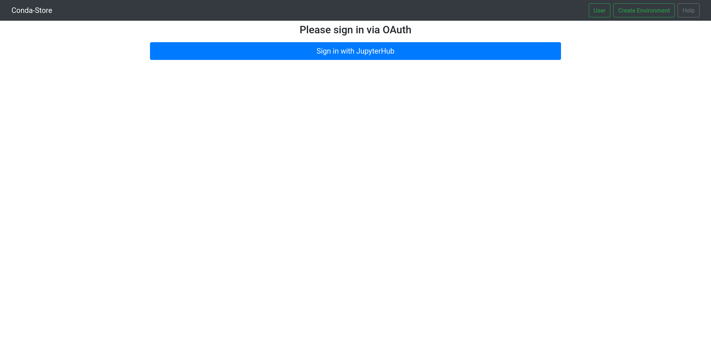
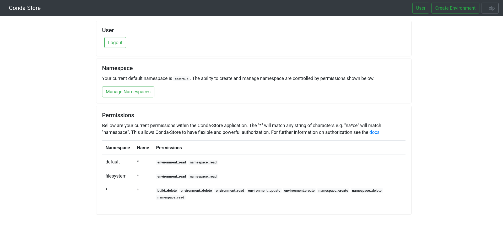
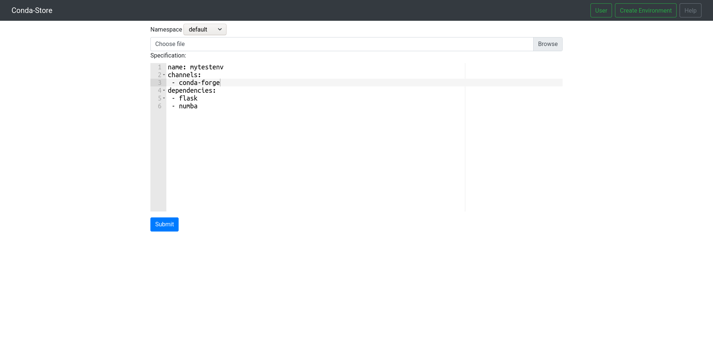
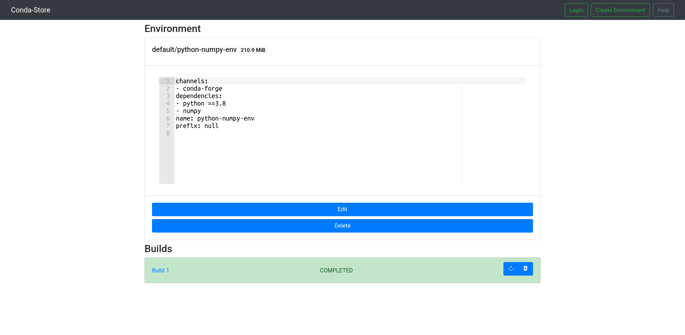

# User Guide

## Conda Store UI

### `/` Home Page 


The home page shows all of the available environments in the form
`<namespace>/<environment-name>`. If you are authenticated there with
be a `User` button in the top right hand corner to view information
about the currently logged in user. Otherwise there this a `login`
button and significantly less environments will be visible if
any. Additionally there is a convenient `Create Environment` button to
easily create a given environment. There is a `Docs` button that will
take you to the documentation you are currently reading at any time.

Below each of the available environments are shortcuts that allow you
to download of view the [conda
lockfile](https://github.com/conda-incubator/conda-lock),
[yaml](https://docs.conda.io/projects/conda/en/latest/user-guide/tasks/manage-environments.html#creating-an-environment-from-an-environment-yml-file),
[conda pack](https://github.com/conda/conda-pack).

### `/login/` Login



If you are unauthenticated there is a `login` button on the top
navigation bar. This will direct you to the login page. The example
above shows what you will get with JupyterHub authentication.

### `/user/` User



Once a user has completed the authentication flow they will be
directed to the user page. At the moment this page only exposes the
option to logout and the `username` of the registered user.

### `/create/` Create Environment



A user authenticated or unauthenticated has set permissions that allow
the user to create environments in a given namespace. Currently the
create page allows for dragging and uploading of current
`environment.yaml` files in the UI. The specification is the format of
a traditional `environment.yaml` and will report errors if there are
issues with the format of the environment file.

### `/environment/<namespace>/<name>/` Environments



### `/build/<build_id>` Builds


## Docker Registry

Conda Store acts as a full programatic docker registry which allows
for interesting ways to handle Conda environment. In addition this
registry leverages
[conda-docker](https://github.com/conda-incubator/conda-docker) which
builds docker images without docker allowing for advanced caching,
reduced image sizes, and not require elevated privileges.

### General usage

```shell
docker run -it localhost:5000/<namespace>/<environment-name>
```

If you want to use a specific build (say one that was built in the
past and is not the current environment) you can visit the specific
build that you want in the ui and copy its docker registry tag
name. The tag name is a combination of `<specification-sha256>-<build
date>-<build id>-<environment name>` that we will refer to as build
key. An example would be
`localhost:5000/filesystem/python-numpy-env:583dd55140491c6b4cfa46e36c203e10280fe7e180190aa28c13f6fc35702f8f-20210825-180211-244815-3-python-numpy-env`.

```shell
docker run -it localhost:5000/<namespace>/<environment-name>:<build_key>
```

### On Demand Docker Image

Conda-store has an additional feature which allow for specifying the
packages within the docker image name itself without requiring an
actual environment to be created on the conda-store ui side.

The following convention is used
`<registry-url>:<registry-port>/conda-store-dynamic/`. After
`conda-store-dynamic` you specify packages needed separated by
slashes. Additionally you may specify package constraints
e.g. `<=1.10` as `.lt.1.10`. 

As full example support we want python less than `3.8` and numpy
greater than `1.0`. This would be the following docker image
name. `<registry-url>:<registry-port>/conda-store-dynamic/python.lt.3.8/numpy.gt.1.0`. Conda-store
will then create the following environment and the docker image will
download upon the docker image being built.

