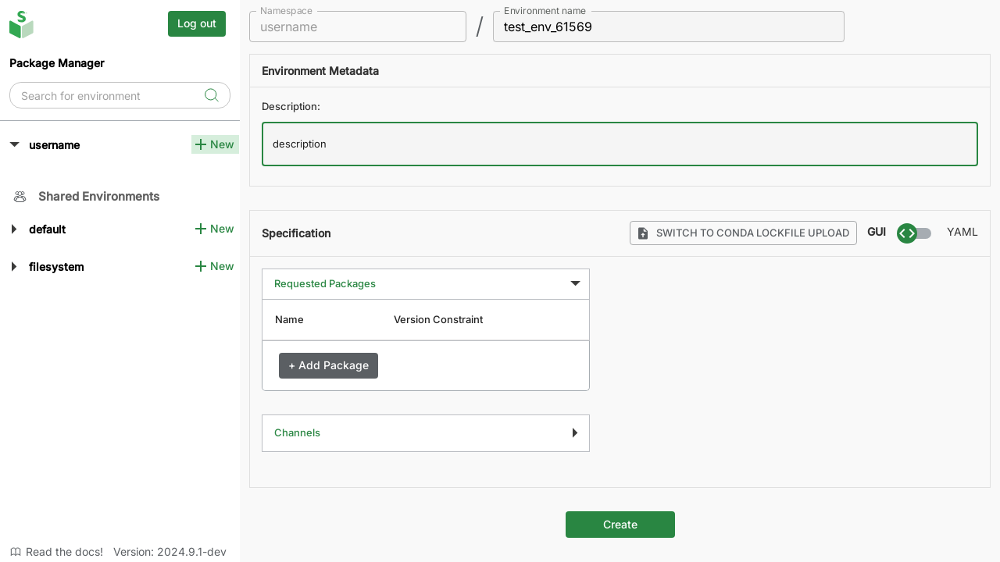
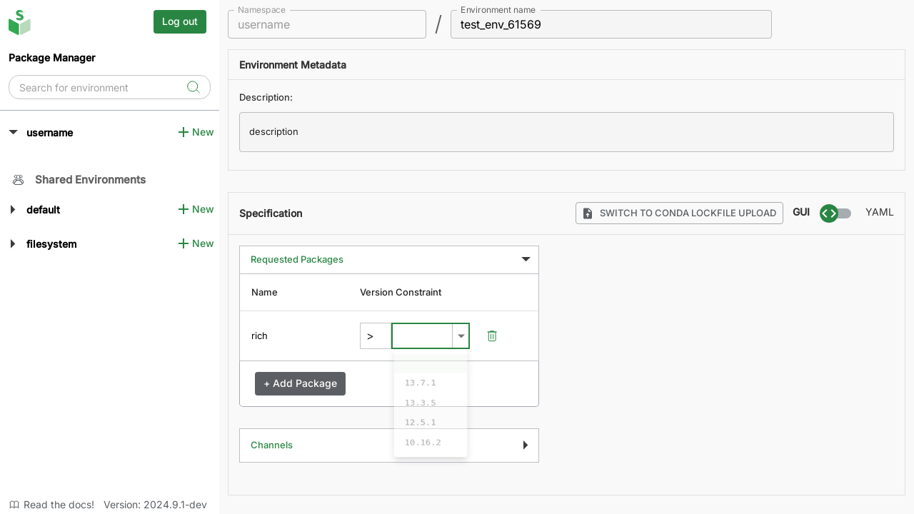
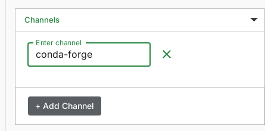
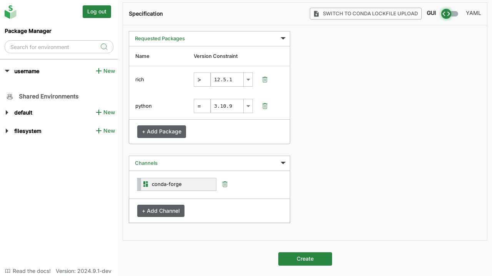
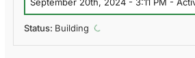

# 2. Create new environments

## Open the "Create Environment" screen

In the left sidebar, click on the "+" icon next to the namespace where you would like to create a new environment.

In the following image, we create a new environment in the "default" namespace:

:::note
In an organization's conda-store, you may have access to create (and edit) environments only in selected namespaces.
If you don't have access, the "+" plus button will be disallowed and displayed in grey.
:::

<!-- TODO: Link to nameaspaces concepts page -->

## Graphical interface

### Add environment name and description

In the environment creation panel, add a suitable name and description for your environment.

### Add required packages

In the "Specification" section of the Environment Creation panel, click on the "+ Add Package" button under "Requested Packages":

In the text field that opens, start typing the package name and select the package from the list. Once selected, press <kbd>Enter</kbd> to add the package.

Next, select the package version and constrain from the dropdown (you can also type in these fields):

### Add preferred channel

To specify the (conda) channels you'd like to install packages from, click on the "+ Add Channel" button under "Channels" in the Specification section, type the name of your preferred channel, and press <kbd>Enter</kbd>.

If not specified, the "conda-forge" channel will be used by default.

### YAML editor

Alternatively, you can use the YAML editor to create environments.
This approach is recommended for users familiar with conda's `environment.yml` specification or for users who need to use `pip` to install some packages.

Click on "Switch to YAML editor" toggle in the Specification section:

Update the specification to include the packages, versions, and channels you need.

### Add PyPI-hosted packages (with `pip`)

:::note
You can install packages using `pip` only through the [YAML editor](#yaml-editor).

Currently, pip-installed packages will **not** be visible in the graphical specification. However, these packages will be installed in your environment.
:::

To install packages published only on [PyPI][pypi] using [`pip`][pip], include a `pip` section (add `pip` as a dependency as well) in the YAML editor.

<!-- TODO:

#### Install from git/mirrors

-->

## Trigger environment creation

Once the name, description, required packages, and channels are specified, click on the "Create" button at the bottom of the screen to trigger environment creation:

A message pops up confirming the environment build. In the "Environment Metadata" section, the "Status" displays "Building" while the environment is created:

The "Status" will change to "Status: Completed in ... min" once the environment is built and ready to use.

<!-- External links -->

[pypi]: https://pypi.org
[pip]: https://pip.pypa.io/en/stable/installation/
