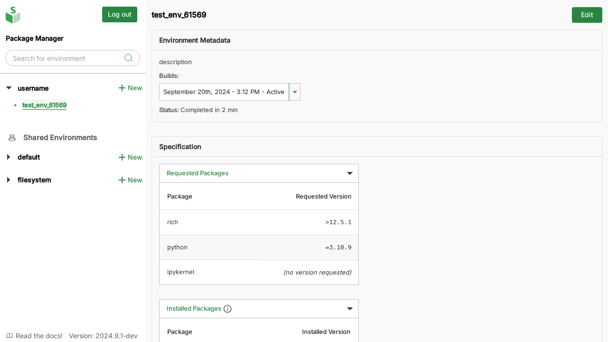
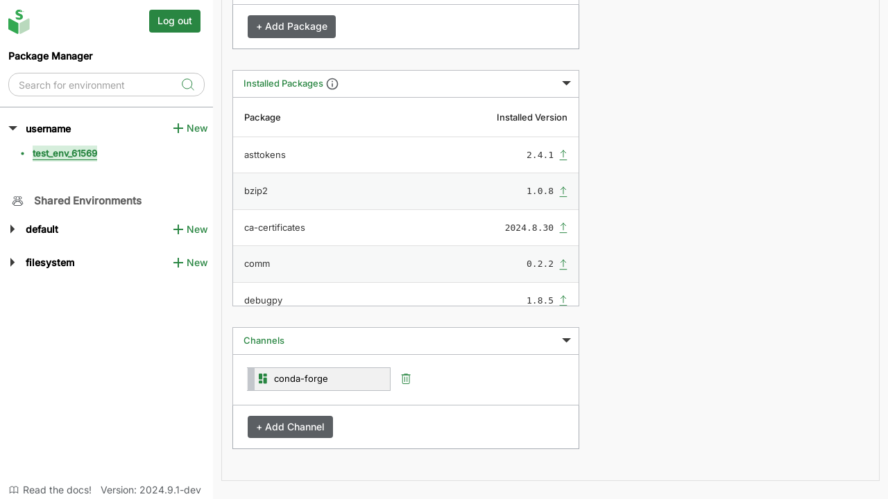

# 3. Edit & delete existing environments

## Edit environments

The process to edit environments is similar to [environment creation][create-envs], because you can edit all the same fields except the environment name.

To edit an existing environment:

1. Click on the corresponding environment name in the left sidebar to select the environment. You may need to expand the corresponding namespace to view the environment.
2. Click on the "Edit" button in the top-right on the environment screen.

3. Make the updates you need, and click on "Save" at the very bottom-right of the screen to re-build the environment with your updates. To cancel the changes made, click on the "Cancel" button.

## Delete environments

To delete an existing environment:

- Go to the "Edit" screen as described in the previous section
- Click on "Delete Environment" at the very bottom-right corner

<!-- Internal links -->

[create-envs]: create-envs.md
