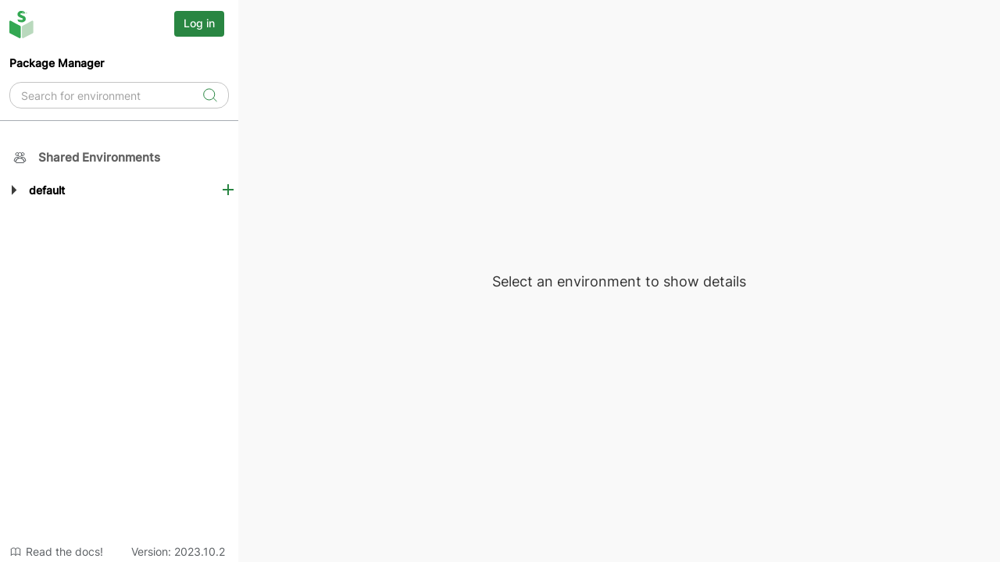

# 1. Setup

## Local deployment

`conda-store-ui` is only the graphical user interface.
It requires `conda-store-server` running in the background to provide environment management features.
You can setup conda-store locally in standalone more or using a Docker-based installation.

### Option 1: Docker-based local setup

Alternatively, you can use the  docker compose file available in the `conda-store-ui` repo. The docker compose file contains both `conda-store-ui` and `conda-store-server`, so it is perfect for a playground.

1. Clone the repository and navigate into the root:

```bash
git clone https://github.com/conda-incubator/conda-store-ui.git
cd conda-store-ui
```

2. Start Docker Compose

```bash
docker compose up --build
```

3. Open conda-store-ui, running at [localhost:8080](https://localhost:8080)

### Option 2: Standalone local setup

:::note
The standalone mode is stable in Linux systems.
For other operating systems, the standalone mode is available on `main` branch and will be included in the next `conda-store-server` release. To use the development branch, follow the instructions in the [contribution guidelines][contribution-guidelines].
:::

1. If you already have `conda-store-server` installed, you can start it in standalone mode to access the UI:

```bash
conda-store-server --standalone
```

2. Visit [localhost:8080](https://localhost:8080)

## Authentication

While you can view certain namespaces and environments, you need to be logged-in to create and edit environments in conda-store.

Locate the `Log in` button in the left sidebar, and click on it.



:::important
The default login combination is:

* username: any username
* password:  `password`
:::

Once logged-in, you can click on the same button to log-out when needed.

<!-- Internal links -->

[contribution-guidelines]: /community/contribute/contribute-code#linux
