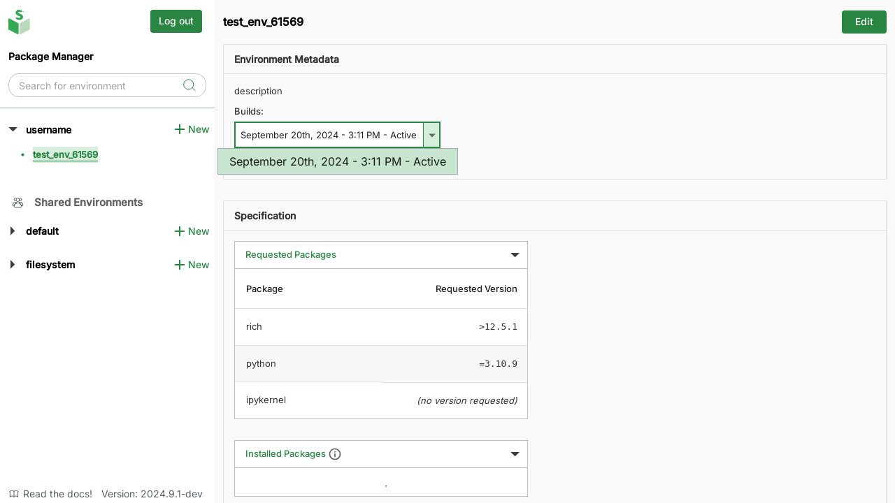
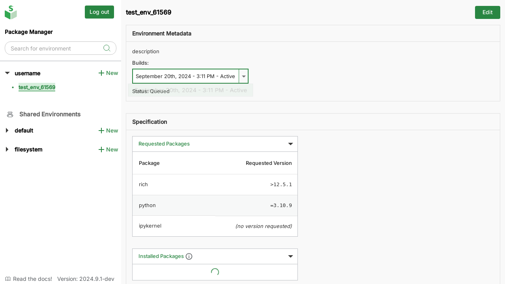

# 4. Switch environment versions

Version control is a key feature offered by conda-store.
When you [edit an environment][edit-env], conda-store builds a fresh environment and automatically sets the updated environment as the default.
You can view other versions of the environment and set them as your active environment if needed.

## View other versions

1. Select an environment from the left sidebar.
2. In the "Environment Metadata" section, under "Builds:", click on the downward arrow to open the environment dropdown. This shows the all versions of your environment with build date and status. The "Active" one is your currently active environment. The "Available" environments are successfully built environments that can be activated if needed.
3. In the dropdown, click on the build you wish to view. The page will be refreshed to display your selected environment.

## Activate a version

To activate a different environment version, [select the corresponding "available" environment version with the instructions mentioned above](#view-other-versions), then:

1. Click on "Edit" to enter the [environment editing screen][edit-env].
2. Click the "Change environment version" button to activate the selected environment. The button will disappear once the environment is activated and the status will change to "Active".
3. Navigate to the bottom of the screen and click on the "Cancel" button to exit the editing screen.

Before selection:

After selection:

<!-- Internal links -->

[edit-env]: edit-delete-envs.md
