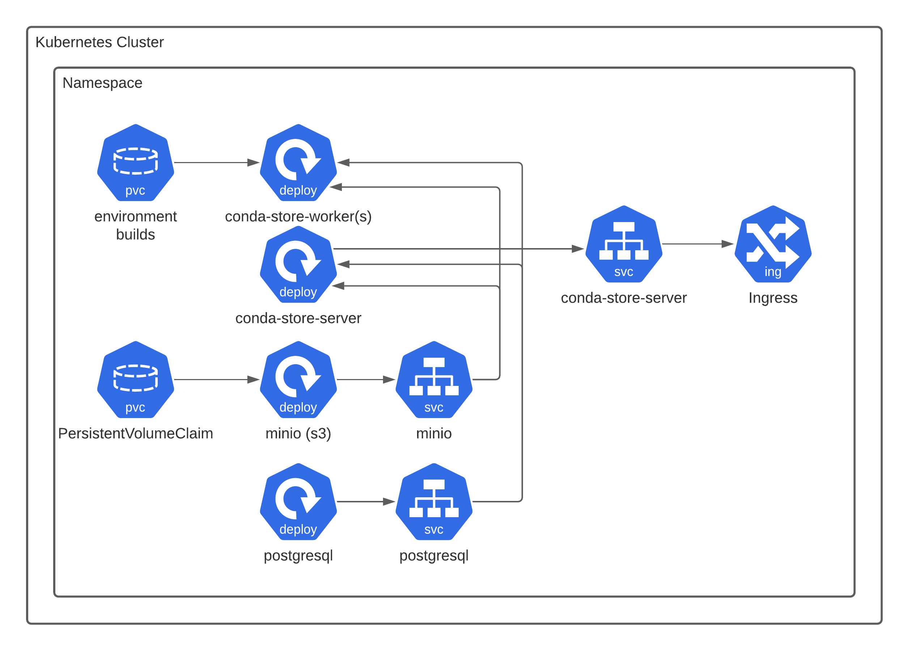

# Local Kubernetes installation

:::warning
This page is in active development, content may be inaccurate and incomplete.
:::



The following will describe a local
[Kubernetes](https://kubernetes.io/) installation via [minikube](https://minikube.sigs.k8s.io/docs/). The
files required are in `examples/kubernetes`

```shell
minikube start --cpus 2 --memory 4096 --driver=docker
```

Now we deploy the `conda-store` components. Note that conda-store is
compatible with any general s3 like provider and any general database
via SQLAlchemy. Currently the docker image is build with support for
PostgreSQL and SQLite. Consult the [SQLAlchemy
documentation](https://docs.sqlalchemy.org/en/14/core/engines.html#database-urls)
on supporting your given database and then creating a custom docker
image with your required database. Not all database engines were added
to save on image size. Additionally You may not need to use MinIO and
PostgreSQL deployments and use existing infrastructure. In the case of
AWS this may mean using [Amazon RDS](https://aws.amazon.com/rds/) and
[s3](https://aws.amazon.com/s3/). Consult your cloud provider for
compatible services. In general if it is supported by SQLAlchemy and
there is a s3 compatible object store conda-store will
work. [kustomize](https://github.com/kubernetes-sigs/kustomize) is
being used for the deployment which is part to the Kubernetes project
itself.

```shell
kubectl apply -k examples/kubernetes
```

Make sure to change all the usernames and passwords for the
deployment.

If your installation worked you should be able to port forward the
conda-store web server.

```shell
kubectl port-forward service/conda-store-server 5000:5000
```

Then visit via your web browser [http://localhost:8080](http://localhost:8080)

For additional configuration options see the [reference guide](../references/configuration-options.md)

A good test that conda-store is functioning properly is to apply the
`jupyterlab-conda-store` pod as a quick test. It will cause
conda-store to build an environment with JupyterLab and NumPy. This
pod is not needed for running conda-store.

```shell
kubectl apply -f examples/kubernetes/test/jupyterlab-conda-store.yaml
```

If you instead mount a
[ReadWriteMany](https://kubernetes.io/docs/concepts/storage/persistent-volumes/)
volume to the container `conda-store-worker` like nfs or
[Amazon EFS](https://aws.amazon.com/efs/). You can mount the environments
built via conda-store and use environments this way. Note that NFS can
be significantly slower when it comes to creating environments (see [explanation about performance](../explanations/performance.md)).
