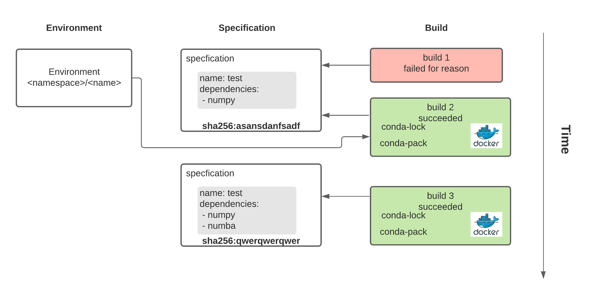

# Architecture

:::warning
This page is in active development, some content may be inaccurate.
:::

conda-store was designed with the idea of scalable enterprise
management of reproducible Conda environments.

## Configuration

[Traitlets](https://traitlets.readthedocs.io/en/stable/) is used for
all configuration of conda-store. In the beginning command line
options were used but eventually we learned that there were too many
options for the user. Traitlets provides a python configuration file
that you can use to configure values of the applications. It is used
for both the server and worker. See
[`tests/assets/conda_store_config.py`](https://github.com/conda-incubator/conda-store/blob/main/tests/assets/conda_store_config.py)
for a full example.

## Workers and server

conda-store can be broken into two components. The workers which have
the following responsibilities:

- build Conda environments from Conda `environment.yaml` specifications
- build Conda pack archives
- build Conda docker images
- remove Conda builds
- modify symlinks to point current environment to given build
- generally any tasks that can take an unbounded amount of time

All of the worker logic is in `conda_store_server/build.py` and
`conda_store_server/worker/*.py`. Celery is used for managing tasks so
you will see the celery tasks defined in
`conda_store_server/worker/tasks.py` which in turn usually call built
in `CondaStore` functions in `conda_store_server/app.py` or
`conda_store_server/build.py`.

The web server has several responsibilities:

- serve a UI for interacting with Conda environments
- serve a REST API for managing Conda environments
- serve a programmatic Docker registry for interesting docker-conda abilities

The web server is based on
[FastAPI](https://fastapi.tiangolo.com/). Originally Flask was chosen
due to it being battle tested and that conda-store is not doing any
special things with the web server. However, over time the ability for
robust input and output guarantees from the endpoints along with auto
documentation made FastAPI appealing. The backend web app is defined
in `conda_store_server.server.app`. There are several components to
the server:

- UI :: `conda_store_server/server/views/ui.py`
- REST API :: `conda_store_server/server/views/api.py`
- registry :: `conda_store_server/server/views/registry.py`

Both the worker and server need a connection to a SQLAchemy compatible
database, Redis, and S3 compatible object storage. The S3 server is
used to store all build artifacts for example logs, docker layers, and
the [Conda-Pack](https://conda.github.io/conda-pack/) tarball. The
PostgreSQL database is used for storing all states on environments and
builds along with powering the conda-store web server UI, REST API,
and Docker registry. Redis is used for keeping track of task state and
results along with enabling locks and realtime streaming of logs.

## Terminology

`conda_environment = f(open("environment.yaml"), datatime.utcnow())`

- namespace :: a way of providing scopes between environments. This
  prevents Joe's environment named `data-science` from colliding from
  Alice's environment name `data-science`.
- environment :: a pointer to a current build of a given specification
- specification :: a [Conda environment.yaml file](https://docs.conda.io/projects/conda/en/latest/user-guide/tasks/manage-environments.html#create-env-file-manually)
- build :: a attempt of `conda env install -f environment.yaml` at a
  given point in time

In order to understand why we have the complicated terminology for an
environment it helps to understand how Conda builds a given
environment.
